```{r}
#| label: setup
#| include: false
library(tidyverse)
library(kableExtra)
```

## About Me {.light-centered .center style="font-size: 30px; line-height: 1.5;"}

::: {.columns}
::: {.column width="34%"}

:::

::: {.column width="66%"}
- **Pingfan Hu**, PhD Candidate at George Washington University, advised by Dr. John Helveston.

- Research interests:
  <div style="margin-left: 1em; line-height: 1;">
    1. **Data Science** in transportation systems and human behavior
    2. **Open-Source Software** in <svg xmlns="http://www.w3.org/2000/svg" viewBox="0 0 581 512" aria-label="R" style="height: 0.85em; vertical-align: -0.1em; fill: currentColor;"><!-- Font Awesome Free r-project icon (CC BY 4.0) --><path d="M581 226.6C581 119.1 450.9 32 290.5 32S0 119.1 0 226.6C0 322.4 103.3 402 239.4 418.1V480h99.1v-61.5c24.3-2.7 47.6-7.4 69.4-13.9L448 480h112l-67.4-113.7c54.5-35.4 88.4-84.9 88.4-139.7zm-466.8 14.5c0-73.5 98.9-133 220.8-133s211.9 40.7 211.9 133c0 50.1-26.5 85-70.3 106.4-2.4-1.6-4.7-2.9-6.4-3.7-10.2-5.2-27.8-10.5-27.8-10.5s86.6-6.4 86.6-92.7-90.6-87.9-90.6-87.9h-199V361c-74.1-21.5-125.2-67.1-125.2-119.9zm225.1 38.3v-55.6c57.8 0 87.8-6.8 87.8 27.3 0 36.5-38.2 28.3-87.8 28.3zm-.9 72.5H365c10.8 0 18.9 11.7 24 19.2-16.1 1.9-33 2.8-50.6 2.9v-22.1z"/></svg> tools for survey research
    3. **Agentic AI Engineering** around Claude Code
  </div>

- For more information, visit [**pingfan.org**](https://pingfan.org)
:::
:::

::: {.notes}
Hi! My name is Pingfan Hu, a PhD Candidate at the George Washington University, advised by Dr. John Helveston.

My research interests are data science in transportation systems and human behavior, open-source software in R tools for survey research, and agentic AI engineering around Claude Code.

For more information, you can visit my website at pingfan.org.
:::

## EV sales in US reaching ~10% of sales {style="text-align: center;" .light-centered .center}

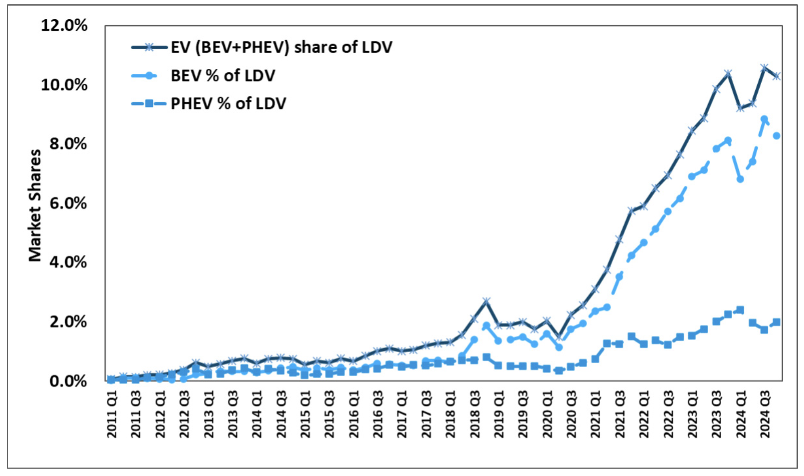{fig-align="center" width="80%"}

::: {style="width: 80%; margin: 0 auto; text-align: right; font-size: 24px;"}
Source: Argonne National Lab, [www.anl.gov/ev-facts/model-sales](https://www.anl.gov/ev-facts/model-sales)
:::

::: {.notes}
Let's get started!

Throughout the past decade, the US market has witnessed a significant surge in electric vehicle sales, reaching about 10% of all vehicles. The BEVs, short for Battery Electric Vehicles, take the majority of them. However, the high ownership of BEVs has brought challenges to the grid. 
:::

## Background {.smaller .light-centered .center}

- **Unmanaged** BEV charging is becoming a problem to the grid.
- **Managed** charging is cheaper and smooths out the grid load.
- **Smart** charging: Supplier-Managed Charging (SMC) and Vehicle-to-Grid (V2G).

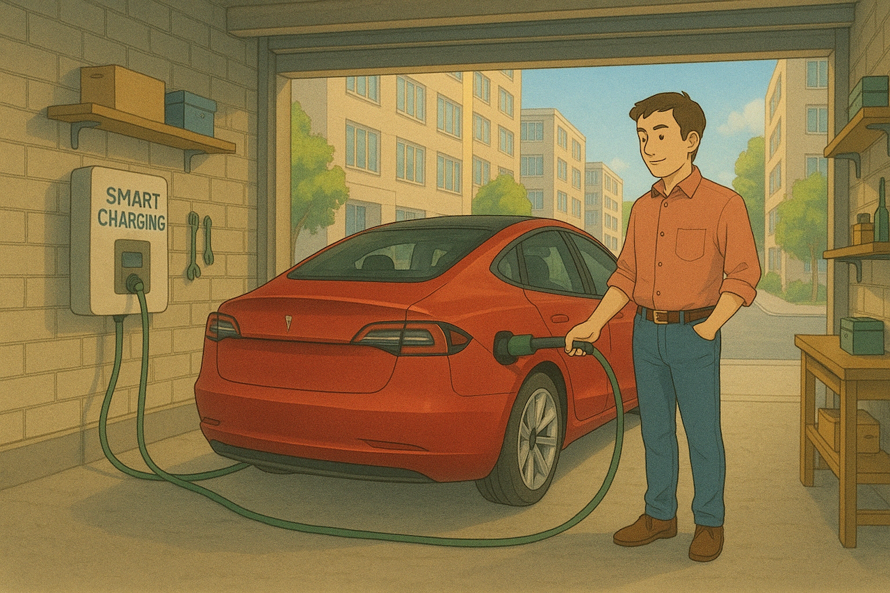{fig-align="center" width="65%"}

::: {.notes}
Unmanaged BEV charging is becoming a problem to the grid due to the spike. That's why we need managed charging to smooth out the grid load as well as keep the price low.

Smart charging is a type of managed charging, which includes Supplier-Managed Charging, shortened as SMC, and Vehicle-to-Grid, shortened as V2G.
:::

## SMC - Supplier Managed Charging {.light-centered .center}

- SMC smooths out overnight BEV charging demand.
- Electricity demand is controlled below the capacity threshold.
- It saves money and reduces pollution.

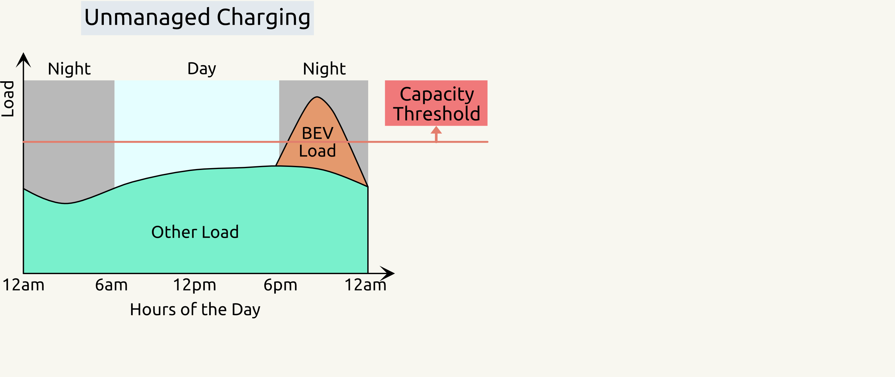{fig-align="center"}

::: {.notes}
For SMC, Supplier-Managed Charging, it smooths out the overnight BEV charging demand.

As you can see, with unmanaged charging, the BEV load easily exceeds the capacity threshold.
:::

## SMC - Supplier Managed Charging {.light-centered .center}

- SMC smooths out overnight BEV charging demand.
- Electricity demand is controlled below the capacity threshold.
- It saves money and reduces pollution.

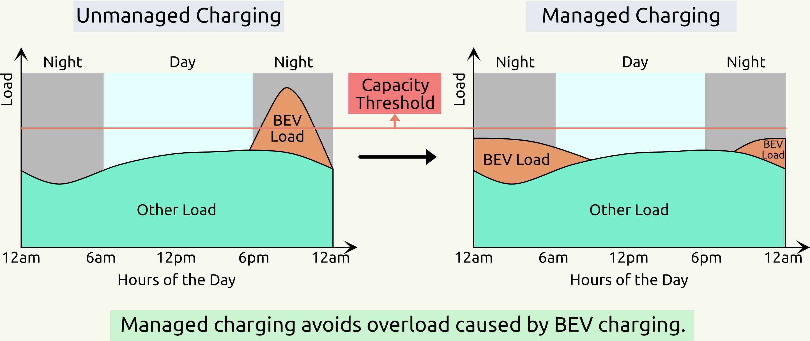{fig-align="center"}

::: {.notes}
But with SMC, the electricity demand is controlled below the threshold. It reduces the peak demand and saves money.
:::

## V2G - Vehicle-to-Grid {.light-centered .center}

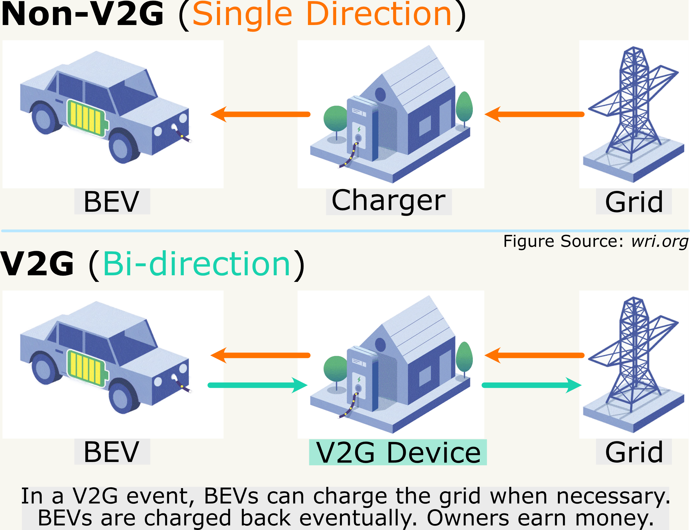{fig-align="center" width="70%"}

::: {.notes}
V2G is short for Vehicle-to-Grid. It is another type of smart charging that allows BEV owners to sell electricity back to the grid. With V2G, BEVs become potential sources of electricity.
:::

## [Smart charging depends on enrollment.]{style="text-align: center; display: block;"} {.light-centered .center}

::: {.notes}
However, the effectiveness of smart charging really depends on the enrollment of the BEV owners.
:::

## Literature Review {.light-centered .center}

1. A study by @wong_incentives_2023 examined how **incentives** affect EV owners' acceptance, <span style="color: #739C69">but EV ownership is only 19%</span>.
2. A study by @philip_consumer_2024 found **range anxiety** matters, <span style="color: #739C69">but EV ownership is only 1.28%</span>.
3. Another study by @huang_are_2021 indicates the importance of **fast charging**, <span style="color: #739C69">but the sample size is only 157</span>.

None of them have demographic data to study <span style="color: #739C69">heterogeneity</span>.

::: {.centered-text .container}
We need high BEV ownership & a large sample size, and consider heterogeneity.
:::

::: {.notes}
There have been a few studies that looked at people's willingness to participate in smart charging programs, but they all have small sample sizes and low EV ownership. Therefore, we aimed to conduct a large-scale survey with high BEV ownership to study the heterogeneity of BEV owners' preferences.
:::

## Research Questions {style="line-height: 2;" .light-centered .center}

1. **Sensitivity**: How do changes in smart charging program **features** influence BEV owners' willingness to opt in?

2. **Enrollment Rate**: Under what **combinations of features** will BEV owners be more willing to opt in to smart charging programs?

<br>

::: {.centered-text .container}
**Conjoint survey** to collect BEV owners' willingness.
:::

::: {.centered-text .container}
**Multinomial logit model** for utility simulations.
:::

::: {.notes}
Here we have 2 research questions. Firstly, we want to know the sensitivity of each smart charging program feature; secondly, we want to know under what combinations of these features will BEV owners be more willing to opt in.

In order to answer these questions, we designed a conjoint survey to collect BEV owners' willingness to participate. Then we used multinomial logit models to simulate the utility of each program feature.
:::

## Survey Design with `formr` {.light-centered .center}

<br>
<br>

::: {.columns}
::: {style="text-align: center;" .column .fragment}
### Conjoint Questions {style="text-align: center; font-size: 36px; color: #739C69;"}
1. Monetary Incentives
2. Charging Limitations
3. Flexibility
:::

::: {style="text-align: center;" .column .fragment}
### Demographic Questions {style="text-align: center; font-size: 36px; color: #739C69;"}
1. BEV Ownership
2. Personal Info
3. Household Info
:::
:::

::: {.notes}
We used formr to design the survey. It's an open-source survey platform that supports R coding. In this survey, we have conjoint questions to ask for willingness to participate, and multiple choice questions to collect demographic information.
:::

## Conjoint Question Explained {.light-centered .center}

### A Sample Conjoint Question {style="padding-top: 0.5em; text-align: center; font-size: 36px; color: #739C69;"}

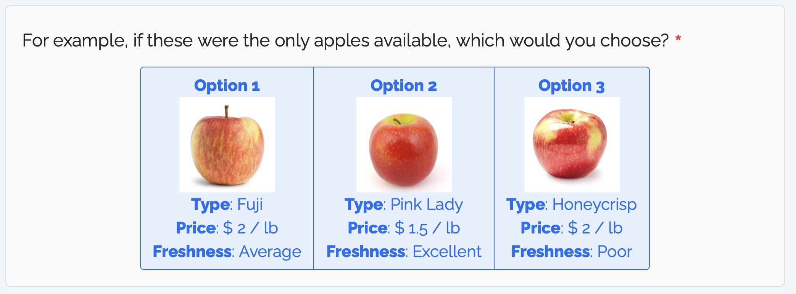{fig-align="center" width="80%"}

::: {style="margin-left: 3em;"}
1. Provide respondents with different **sets** of attributes.
2. Observe choices across random sets.
3. Estimate **utility** of each attribute.
:::

::: {.notes}
But first, I want to explain what a conjoint question is. If I care about apples, I would want to know how people value type vs price vs freshness. In this apple example, you can only choose one set of the attributes, so if you pick one option, you pick all the attributes in it. In short, conjoint is about forcing people to make trade-offs.
:::

## SMC Programs {.smaller style="line-height: 1.8;" .light-centered .center}

::: {.columns}
::: {.column .fragment style="padding-top: 0.5em;"}

### Attributes {style="text-align: center; font-size: 36px; color: #739C69;"}

::: {style="border: 2px solid #333; border-radius: 8px;"}

```{r}
smc_attributes <- tibble(
    `No.` = seq(1,5),
    Attributes = c("Enrollment Cash", "Monthly Cash", "Monthly Override",
                   "Min Battery", "Guaranteed Battery"),
    Range = c("$50 to $300", "$2 to $20","0 to 5", "20% to 40%", "60% to 80%")
)

smc_attributes_kable <- smc_attributes %>% 
    kable(escape = FALSE, align = c("c", "l", "l")) %>% 
    kable_styling(position = "center")

smc_attributes_kable
```

:::
:::

::: {.column .fragment style="padding-top: 0.5em;"}

### Sample Program {style="text-align: center; font-size: 36px; color: #739C69;"}

::: {style="border: 2px solid #333; border-radius: 8px;"}

```{r}
smc_options <- tibble(
    Attributes = c("Enrollment Cash", "Monthly Cash", "Monthly Override"),
    Values = c(scales::dollar(300), scales::dollar(20), 5)
)

smc_options_kable <- smc_options %>% 
    kable(escape = FALSE, align = c("c", "c")) %>% 
    column_spec(column = 1, width = '16em') %>%
    column_spec(column = 2, width = '10em') %>% 
    kable_styling(position = "center")

smc_options_kable
```

<div style="text-align: center; font-size: 20px;">

{width="100%" style="width: 400px;"}

(Range determined by stated vehicle they own)

</div>

:::
:::
:::

::: {.notes}
Let's move on to the conjoint question for SMC programs. Again SMC is short for Supplier-Managed Charging. These are the 5 attributes of SMC. You can see there are cash, override, and battery thresholds, and they all have reasonable ranges. For example, for enrollment cash we have $50 to $300.

Here is a sample SMC program. You can see the one-time enrollment cash, recurring monthly cash, and how many times per month the charging can be shifted back to normal.

The battery thresholds here are well-designed to provide an immediate visual aid of the minimum battery and guaranteed battery. We also used mileage instead of percentage to make it more intuitive. The mileage will be shown according to the real values of each participant.
:::

## V2G Programs {.smaller style="line-height: 1.8;" .light-centered .center}

::: {.columns}
::: {.column style="padding-top: 0.5em;"}

### Attributes {style="text-align: center; font-size: 36px; color: #739C69;"}

::: {style="border: 2px solid #333; border-radius: 8px;"}

```{r}
v2g_attributes <- tibble(
    `No.` = seq(1,5),
    Attributes = c("Enrollment Cash", "Occurrence Cash", "Monthly Occurrence",
                   "Lower Bound", "Guaranteed Battery"),
    Range = c("$50 to $300", "$2 to $20","1 to 4", "20% to 40%", "60% to 80%")
)

v2g_attributes_kable <- v2g_attributes %>% 
    kable(escape = FALSE, align = c("c", "l", "l")) %>% 
    kable_styling(position = "center")

v2g_attributes_kable
```

:::
:::

::: {.column style="padding-top: 0.5em;"}

### Sample Program {style="text-align: center; font-size: 36px; color: #739C69;"}

::: {style="border: 2px solid #333; border-radius: 8px;"}

```{r}
v2g_options <- tibble(
    Attributes = c("Enrollment Cash", "Occurrence Cash", "Monthly Occurrence"),
    Values = c(scales::dollar(300), scales::dollar(20), 1)
)

v2g_options_kable <- v2g_options %>% 
    kable(escape = FALSE, align = c("c", "c")) %>% 
    column_spec(column = 1, width = '16em') %>%
    column_spec(column = 2, width = '10em') %>% 
    kable_styling(position = "center")

v2g_options_kable
```

<div style="text-align: center; font-size: 20px;">

{width="100%" style="width: 400px;"}

(Range determined by stated vehicle they own)

</div>

:::
:::
:::

::: {.notes}
This is the conjoint question design for V2G programs. V2G is short for Vehicle-to-Grid. The attributes are similar to SMC, but with some differences. For example, we have monthly occurrence instead of monthly override.

The battery thresholds are in the same layout, but since V2G drains the battery, the lower bound is how much the battery is drained to, and guaranteed battery is how much it's charged back to.
:::

## Sample SMC Question {.light-centered .center}

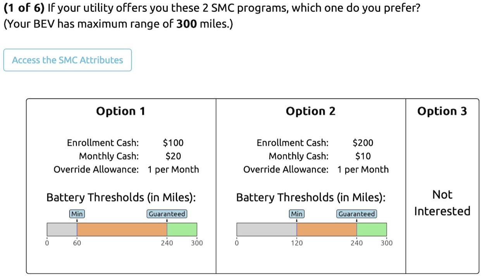{fig-align="center"}

::: {.notes}
There are 6 SMC conjoint questions. In each question, participants are provided with 2 valid options and a "Not Interested" option. It's important to have this "Not Interested" option, because it is a validation of willingness. When participants choose from these 2 valid options, they are sure to be interested in what they choose. Otherwise, they will choose "Not Interested".
:::

## Sample V2G Question {.light-centered .center}

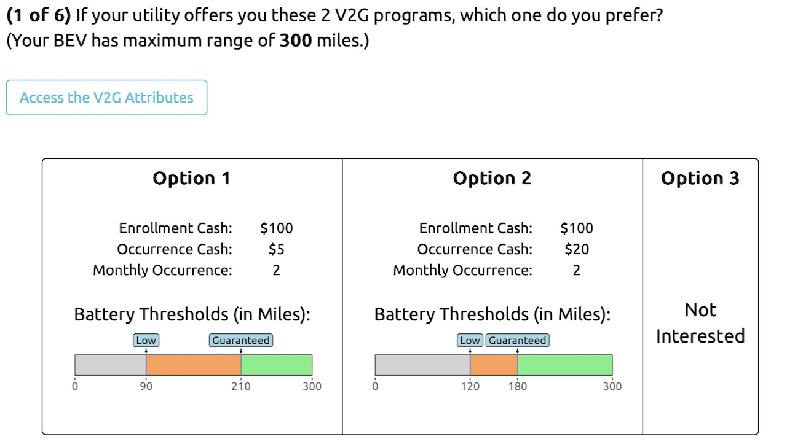{fig-align="center"}

::: {.notes}
Likewise, there are 6 V2G conjoint questions.
:::

## Survey Fielding - 1,356 in Total {.light-centered .center .left-lists}

::: {.columns}
::: {.column width="40%"}

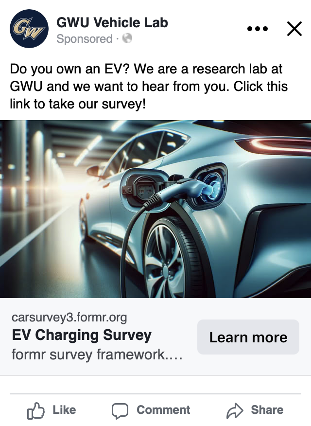

:::

::: {.column width="60%"}

<span style="color: #739C69">**Meta Ads**</span>: Voluntary participants

- **803** responses
- March to July in 2024

<span style="color: #739C69">**Dynata Recruitment**</span>: Paid survey

- **553** responses
- September to November in 2024


:::
:::

::: {.notes}
We collected a total of 1,356 complete, filtered responses from Meta and Dynata throughout 2024, and we made sure that all participants are real BEV owners.
:::

## Survey Question - Car Ownership {.light-centered .center}

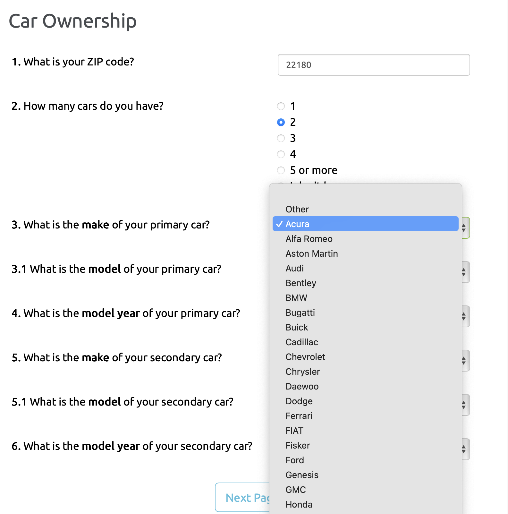{fig-align="center" width="55%"}

::: {.notes}
This is how we did it. In this Car Ownership section, we asked how many cars they have. Then based on the number of cars, they need to select their make, model, and year of them. If at least one of them is a BEV, then we consider the participant as a BEV owner. Instead of asking if they own a BEV, this is a more reliable way.
:::

## Survey Results - Top 10 BEV {.light-centered .center}
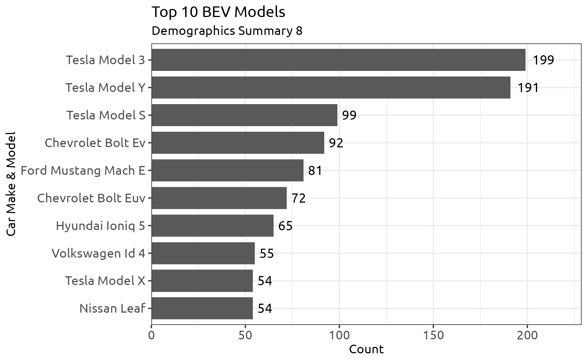

::: {.notes}
This is a showcase of the top 10 BEV models from our survey results. You can see that Tesla is the most popular brand, followed by Ford, Chevrolet, and some other popular brands. These results are also representative of the BEV market in the United States.
:::

## Survey Results - Demographics {.light-centered .center}

::: {.fragment style="fig-align: center;"}
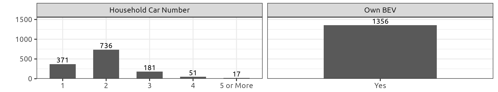
:::

::: {.fragment style="fig-align: center;"}
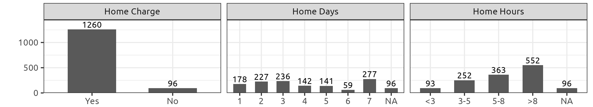
:::

::: {.fragment style="fig-align: center;"}
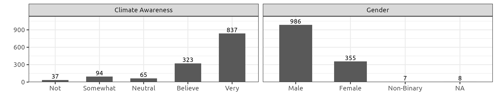
:::

::: {.notes}
Other than the BEV models, there are also some important demographic information collected in the survey. You can see most families have 2 cars; most owners charge at home for more than 8 hours; and most of them care about climate very much. And more importantly, we have 100% BEV ownership.
:::

## Survey Results - Willingness to Participate {.smaller .light-centered .center}

::: {.fragment}
### Multinomial Logit Models {style="text-align: center; font-size: 36px; color: #739C69;"}

$$
\begin{align*}
u_j = v_j + \epsilon_j = \beta' x + \epsilon_j
\qquad
P_j = \frac{e^{v_j}}{\sum_{k=1}^{J} e^{v_k}}
\end{align*}
$$

::: {style="text-align: center;"}
Utility estimated using maximum likelihood estimation (MLE).
:::
:::

::: {.columns .fragment}
::: {.column style="padding-top: 0.5em;"}
### SMC Estimates {style="text-align: center; font-size: 24px; color: #739C69;"}

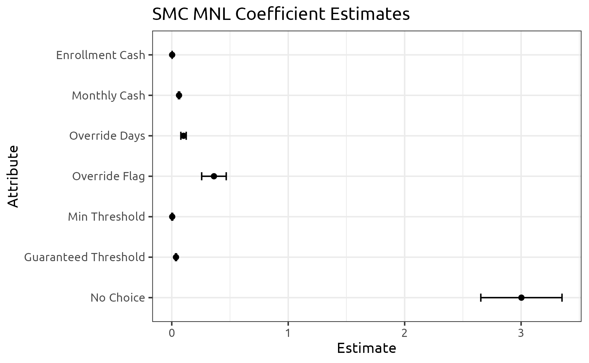{fig-align="center"}
:::

::: {.column style="padding-top: 0.5em;"}
### V2G Estimates {style="text-align: center; font-size: 24px; color: #739C69;"}

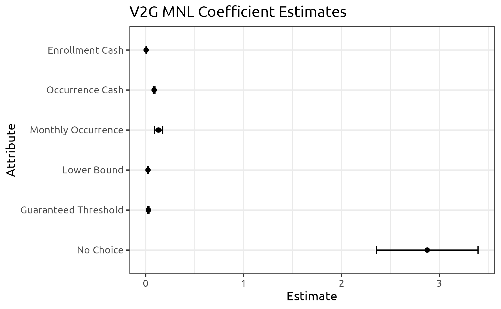{fig-align="center"}
:::
:::

::: {.fragment style="text-align: center;"}
Without compensation, users will not participate.
:::

::: {.notes}
The willingness to participate is quantified with the multinomial logit model, shortened as MNL. The utility of each option is a linear combination of the attributes, which is the $v_j$ here, plus an error term, shown as $\epsilon_j$. The probability of choosing an option is the exponential of its utility divided by the sum of exponentials of all utilities.

Here are the coefficient estimate plots of both programs. As you can see, the "No Choice" has the highest coefficient, which simply means that without compensation, users will not participate in the programs.

However, coefficients alone are not enough to interpret the willingness to participate. A more intuitive approach is the sensitivity, which means by how much the enrollment rate will change when a feature value changes.
:::

## Enrollment Sensitivity {.smaller style="line-height: 1.8;" .light-centered .center}

::: {.columns}
::: {.column style="padding-top: 1em;"}
### Baseline Simulation {style="text-align: center; font-size: 36px; color: #739C69;"}

::: {style="text-align: center; font-size: 24px;"}
Choice between "None" and this program:
:::

::: {style="border: 2px solid #333; border-radius: 8px;"}
```{r}
attribute_table_enroll_cash <- tibble(
    Attributes = c("Enrollment Cash", "Monthly Cash", "Monthly Override"),
    Values = c("$0 - $1000", "$2", "1")
)

attribute_kable_enroll_cash <- attribute_table_enroll_cash %>% 
    kable(escape = FALSE, align = c("c", "c")) %>% 
    column_spec(column = 1, width = '16em') %>%
    column_spec(column = 2, width = '10em') %>% 
    kable_styling(position = "center") %>% 
    row_spec(1, bold = TRUE, color = "#ED6D46")

attribute_kable_enroll_cash
```

::: {style="text-align: center;"}


:::
:::
:::

::: {.column style="padding-top: 1em;"}
### Sensitivity Plot {style="text-align: center; font-size: 36px; color: #739C69;"}
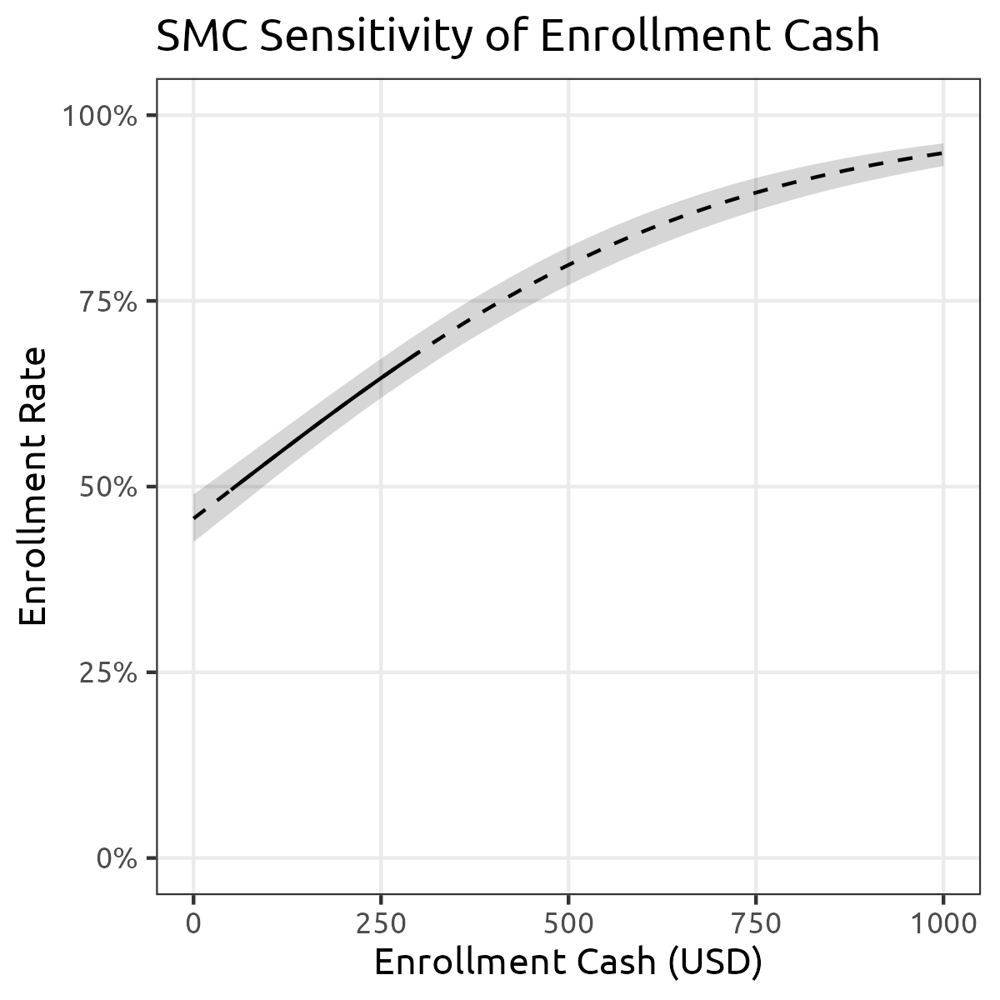{fig-align="center"}
:::
:::

::: {.notes}
This is one example of the sensitivity plots. As the enrollment cash increases, the user enrollment increases as well. The solid part is from the results, and the dotted part is the extrapolation with the model.
:::

## Enrollment Sensitivity {.light-centered .center}

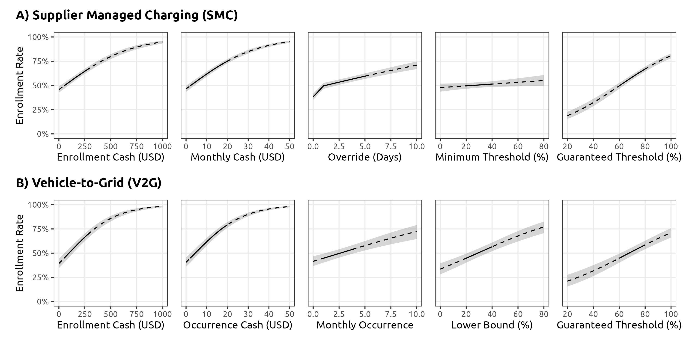{fig-align="center"}

::: {style="text-align: center; font-size: 26px;"}
1. Steeper slope indicates higher sensitivity.
2. Diminishing returns exist.
:::

::: {.notes}
And here we have a full demonstration of all sensitivity plots. Steeper slope indicates higher sensitivity. Also, as the feature values become higher, we see diminishing returns. But the solid parts are basically linear.
:::

## Equivalencies of 5% Enrollment Increase {.light-centered .center}

<br>

::: {.columns}
::: {.column}

### SMC {style="text-align: center; font-size: 36px; color: #739C69;"}

```{r}
smc_attr_equiv <- data.frame(
  Attribute = c("Enrollment Cash", "Monthly Cash", "Override Days",
                "Minimum Threshold", "Guaranteed Threshold"),
  Equivalence = c(77.7, 4.0, 2.5, 65.5, 6.3),
  Unit = c("$", "$", "Days", "%", "%")
)

smc_attr_equiv %>%
  kbl(col.names = c("Attribute", "Equivalence Value", "Unit"),
      align = c("l", "c", "c")) %>%
  kable_styling(font_size = 19) %>%
  row_spec(0, bold = TRUE) %>% 
  row_spec(5, bold = TRUE, color = "#ED6D46")
```

:::

::: {.column}

### V2G {style="text-align: center; font-size: 36px; color: #739C69;"}

```{r}
v2g_attr_equiv <- data.frame(
  Attribute = c("Enrollment Cash", "Occurrence Cash",
                "Monthly Occurrence", "Lower Bound",
                "Guaranteed Threshold"),
  Equivalence = c(55.7, 2.9, 1.9, 11.7, 9.1),
  Unit = c("$", "$", "Times", "%", "%")
)

v2g_attr_equiv %>%
  kbl(col.names = c("Attribute", "Equivalence Value", "Unit"),
      align = c("l", "c", "c")) %>%
  kable_styling(font_size = 19) %>%
  row_spec(0, bold = TRUE) %>% 
  row_spec(c(1, 2), bold = TRUE, color = "#ED6D46")
```

:::
:::

<br>

::: {style="font-size: 26px;"}
1. **Smaller** value indicates higher efficiency.
2. **Monetary** incentives are valued more in V2G than SMC.
3. **Guaranteed** thresholds are highly efficient, indicating range anxiety.
4. Attribute equivalencies can be used to inform incentive design.
:::

::: {.notes}
Because the sensitivity plots are linear in the areas we're concerned with, there is a convenient way to reveal the relative importance of each feature. Imagine we want to increase 5% of enrollment for each program. We start from baseline, and increase each feature value individually. Then we can see how much each one needs to be, in order to achieve the 5% enrollment increase. And here are our interpretations:

To start with, smaller value indicates higher efficiency, and recurring incentives are more important than one-time. For example, in SMC, the enrollment cash needs to be \$77.7 to achieve a 5% enrollment increase, while for monthly cash, it only needs to be \$4.0. So monthly cash is more efficient than enrollment cash. Same is true for the 2 types of cash in V2G.

Also, guaranteed threshold is more important in SMC than in V2G, indicating range anxiety. Finally, monetary incentives are valued more in V2G than in SMC. This indicates that BEV owners are willing to leverage their BEVs as a source of income.
:::

## SMC Scenario Analysis {.light-centered .center}
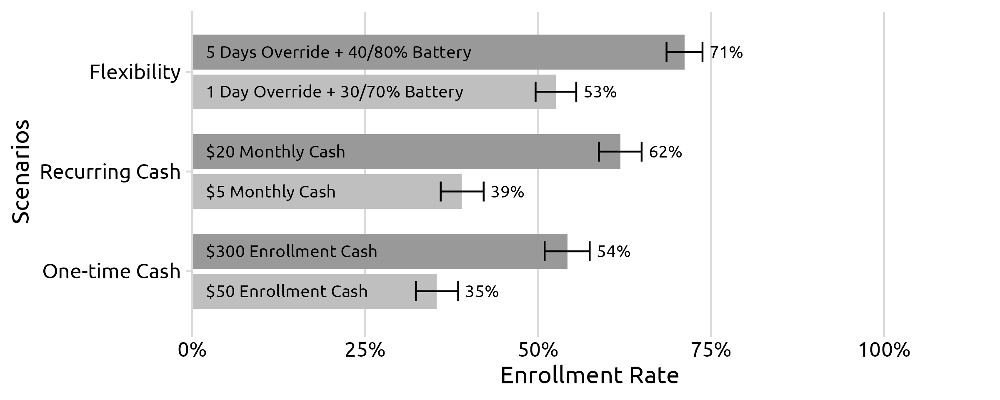{fig-align="center"}

::: {style="font-size: 26px;"}
1. **Flexibility** is highly valued.
2. **Recurring** incentives are more important than one-time ones.
3. Payment alone is not enough.
:::

::: {.notes}
So, after analysis of all these individual features, we can combine them into programs. We call them "scenarios". I want to emphasize that the purpose of doing these evaluations is to wisely allocate the resources of the grid. Therefore, we need to maximize the enrollment of each program with the least effort.

Here for SMC we have 3 scenarios. They are flexibility, recurring cash, and one-time cash.

As we can see, for SMC, flexibility is highly valued, and recurring incentives are more important than one-time. So due to the range anxiety, payment alone is not enough. There should be a combination of flexibility and monetary incentives.
:::

## V2G Scenario Analysis {.light-centered .center}
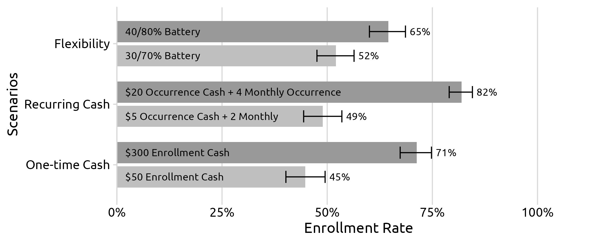{fig-align="center"}

::: {style="font-size: 26px;"}
1. Still, **recurring** incentives are more important than one-time ones.
2. But **flexibility** is not as important as in SMC.
3. Owners are willing to leverage BEV as a source of income.
:::

::: {.notes}
For V2G programs, recurring incentives are also more important than one-time. But flexibility is compromised since owners are willing to use their BEVs as a source of income. So the V2G programs are more incentive-powered than SMC programs.
:::

## Smart Charging Enrollment Simulator {style="text-align: center;" .light-centered .center}

[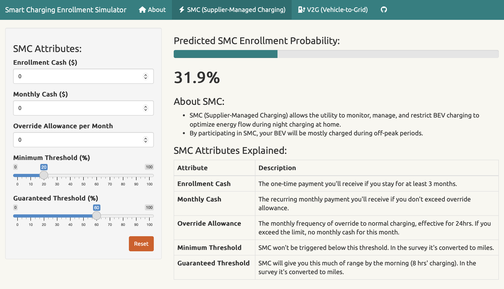{width="100%" fig-align="center" style="border: 2px solid #5654A2;"}](https://gwuvehicle.shinyapps.io/enrollment_simulator/)

::: {.notes}
Here we've made a smart charging enrollment simulator. We can play around with it and see the anticipated enrollment of each program, with different feature values.

1. More enrollment increase in SMC: Guaranteed threshold from 60% to 100%.
2. More enrollment increase in V2G: Recurring cash from $2 to $20.
:::

## Contributions {.light-centered .center}

<br>

1. First **large N** study of BEV owners' preferences for smart charging programs.
2. Quantified the **sensitivity** of BEV owners' preferences for smart charging features.
3. Introduced the concept of attribute **equivalencies** to inform incentive design.

## Appendix - SMC Logit Model {.smaller .light-centered .center}

$$
\begin{align*}
u_j = \beta_1 x_j^{\text{enroll_cash}} + \beta_2 x_j^{\text{monthly_cash}} + \beta_3 \delta_j^{\text{override_allowed}} + \beta_4 x_j^{\text{num_overrides}} \notag \\ + \beta_5 x_j^{\text{min_threshold}} + \beta_6 x_j^{\text{guaranteed_threshold}} + \beta_7 \delta_j^{\text{no_choice}} + \epsilon_j
\end{align*}
$$

::: {style="border: 2px solid #333; border-radius: 8px;"}

```{r}
smc_coef <- data.frame(
  Attribute = c("Enrollment Cash", "Monthly Cash", "Override Days", 
                "Override Flag", "Minimum Threshold", "Guaranteed Threshold", "No Choice"),
  `Coef.` = c("β₁", "β₂", "β₃", "β₄", "β₅", "β₆", "β₇"),
  `Est.` = c(0.0031, 0.0623, 0.1010, 0.3622, 0.0037, 0.0362, 3.0026),
  SE = c(0.0002, 0.0027, 0.0118, 0.0538, 0.0021, 0.0021, 0.1779),
  Level = c("50, 100, 200, 300", "2, 5, 10, 15, 20", "0, 1, 3, 5", 
            "Yes, No", "20, 30, 40", "60, 70, 80", "-"),
  Unit = c("USD", "USD", "Days", "-", "%", "%", "-")
)

smc_table <- kable(smc_coef, booktabs = TRUE, 
                   align = c("l", "c", "c", "c", "c", "c"),
                   escape = FALSE) %>%
  kable_styling(latex_options = c("striped", "scale_down")) %>%
  row_spec(0, bold = TRUE) %>%
  add_header_above(c(" " = 6))

smc_table
```

:::

## Appendix - V2G Logit Model {.smaller .light-centered .center}

$$
\begin{align*}
u_j = \beta_1 x_j^{\text{enroll_cash}} + \beta_2 x_j^{\text{occur_cash}} + \beta_3 x_j^{\text{num_occurrences}} + \beta_4 x_j^{\text{lower_threshold}} \notag \\ + \beta_5 x_j^{\text{guaranteed_threshold}} + \beta_6 \delta_j^{\text{no_choice}} + \epsilon_j
\end{align*}
$$

::: {style="border: 2px solid #333; border-radius: 8px;"}

```{r}
v2g_coef <- data.frame(
  Attribute = c("Enrollment Cash", "Occurrence Cash", "Monthly Occurrence", 
                "Lower Threshold", "Guaranteed Threshold", "No Choice"),
  `Coef.` = c("β₁", "β₂", "β₃", "β₄", "β₅", "β₆"),
  `Est.` = c(0.0045, 0.0863, 0.1305, 0.0237, 0.0278, 2.8759),
  SE = c(0.0026, 0.0040, 0.0217, 0.0030, 0.0030, 0.2647),
  Level = c("50, 100, 200, 300", "2, 5, 10, 15, 20", "1, 2, 3, 4", 
            "20, 30, 40", "60, 70, 80", "-"),
  Unit = c("USD", "USD", "Times", "%", "%", "-")
)

v2g_table <- kable(v2g_coef, booktabs = TRUE, 
                   align = c("l", "c", "c", "c", "c", "c"),
                   escape = FALSE) %>%
  kable_styling(latex_options = c("striped", "scale_down")) %>%
  row_spec(0, bold = TRUE) %>%
  add_header_above(c(" " = 6))

v2g_table
```

:::

## Reference List {.center}
